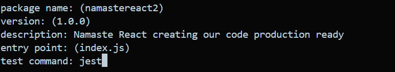

  

# Theory Assignment:

Q. What is 'NPM'?
A. NPM is like a remote repository that contains packages / dependencies that can be installed and use in our apps. npm manages, tracks, maintains packages.

Q. What is `Parcel/Webpack`? Why do we need it?
A. These are bundlers the most imp packages that helps to make our app production ready by doing bundling, minification, chunking of code.

Q.  What is `.parcel-cache`?
A. Its a cache folder that stores information about your project when parcel builds it, so when it re-builds parcel don't have to re-parse, re-analyse from scratch. which makes parcel fast in development phase.

Q.  What is `npx` ?
A. npx is used to execute the packages. like npx parcel index.html in this way parcel will gets executed.

Q.  What is difference between `dependencies` vs `devDependencies`.
A. normal dependencies are used for production builds 
   devDependencies are used in development phase or enivronment.

   normal dependencies takes time to build as it performs more operation to make project production ready.
   devDependencies usually takes less time as used for development phase.

Q. What is Tree Shaking?
A. Its a dead code elimination technique used during code optimization.

Q. What is Hot Module Replacement?
A. parcel does reload but sometimes performs HMR.
   HMR improves development experience by updating modules in the browser at runtime withoud needing to refresh the page.

Q.  List down your favourite 5 superpowers of Parcel and  describe any 3 of them in your
own words.
A. Local Server
    File Watching Algorithm
    Minification
    Compress
    Different dev and prod build

Q. What is `.gitignore`? What should we add and not add into it?
A. files which we don't want to upload it to github and don't need to track of. Simply write those file names in .gitignore file. 
files that can be regenarates should be added in gitignore file.
files that can help regenarates certain files as it contains cruical informations should not be kept in gitignore.

Q.  What is the difference between `package.json` and `package-lock.json`.
A. package.json keeps approx version package ex. with ^ and ~
whereas package-lock keeps exact version for packages.

package.json is configuration of npm 
package-lock.json file keeps sha512 in integrity to check our local code and server contains same versions (versions cross-checking) It ensures that the same versions of packages are used across different installations or environments

Q. Why should I not modify `package-lock.json`?
To ensure consistency and reproducibility across different environments, both files should be committed to version control, and developers should be careful not to modify the package-lock.json file directly.

if suppose i modify package-lock.json and i accedently deleted node_modules then regenrating node_modules will be difficult right one of the reason.

second it ensures consistency that app locally and on server has same versions. using integrity.

Q. What is `node_modules` ? Is it a good idea to push that on git?
A. node_modules contains code of all packages/dependencies our project. It should not be pushed onto git as its a regenratable file.

Q. What is the `dist` folder?

A. dist folder: parcel generates dev build of project and puts inside dist folder and that dev build is the file which is hosted in server 1234

 What is `browserlists`
 browserlists where versions of browser and what browsers our app can be supported is mentioned.
